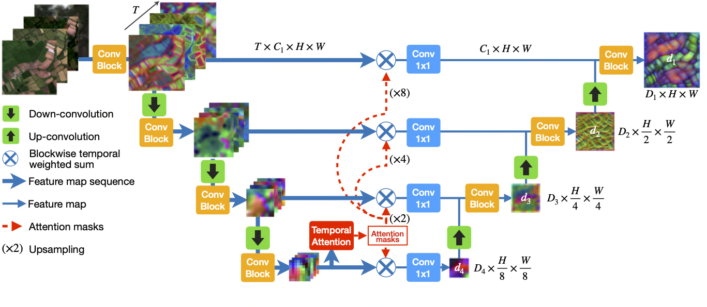
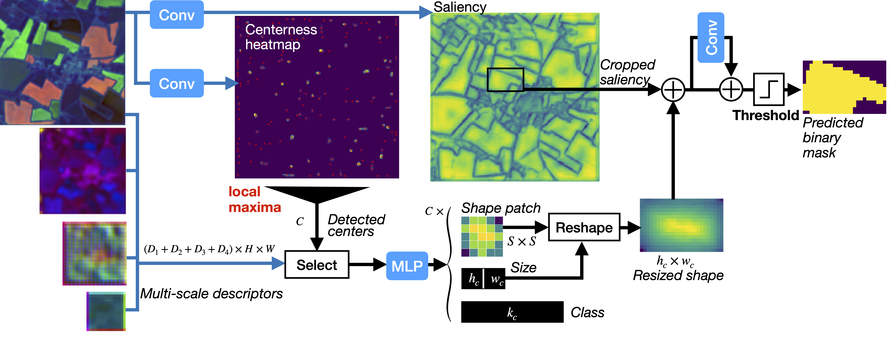

# Panoptic Segmentation of Satellite Image Time Series with Convolutional Temporal Attention Networks (ICCV 2021)


This repository is the official implementation of [Panoptic Segmentation of Satellite Image Time Series with Convolutional Temporal Attention Networks
](https://arxiv.org/abs/2107.07933). 

[](https://paperswithcode.com/sota/semantic-segmentation-on-pastis?p=panoptic-segmentation-of-satellite-image-time)

[](https://paperswithcode.com/sota/panoptic-segmentation-on-pastis?p=panoptic-segmentation-of-satellite-image-time)

## Contents
This repository contains the following PyTorch code:
- [Implementation](https://github.com/VSainteuf/utae-paps/blob/main/src/backbones/utae.py) of **U-TAE** spatio-temporal encoding architecture for satellite image time series

- [Implementation](https://github.com/VSainteuf/utae-paps/blob/main/src/panoptic/paps.py) of **Parcels-as-Points (PaPs)** module for panoptic segmentation of agricultural parcels

- Code for reproduction of the paper's results for panoptic and semantic segmentation.


## Results

Our model achieves the following performance on :

### PASTIS - Panoptic segmentation

Our spatio-temporal encoder U-TAE combined with our PaPs instance segmentation module achieves 40.4 Panoptic Quality (PQ) on PASTIS for panoptic segmentation.
When replacing U-TAE with a convolutional LSTM the performance drops to 33.4 PQ.

| Model name         | SQ  | RQ | PQ|
| ------------------ |--- | --- |--- |
| **U-TAE + PaPs** (ours)      | **81.3**|**49.2** |**40.4**|
| UConvLSTM+PaPs  | 80.9|   40.8   |  33.4|

### PASTIS - Semantic segmentation
Our spatio-temporal encoder U-TAE yields a semantic segmentation score of 63.1 mIoU on PASTIS, achieving an improvement of approximately 5 points compared to the best existing methods that we re-implemented (Unet-3d, Unet+ConvLSTM and Feature Pyramid+Unet).
See the paper for more details.

| Model name         | #Params| OA  |  mIoU |
| ------------------ |---- |---- | ---|
| **U-TAE**  (ours) |   **1.1M**|  **83.2%**    | **63.1%**|
| Unet-3d   | 1.6M|    81.3%    |  58.4%|
| Unet-ConvLSTM |1.5M  |     82.1%    |  57.8%|
| FPN-ConvLSTM  | 1.3M|    81.6%   |  57.1%|


## Requirements

### PASTIS Dataset download
The Dataset is freely available for download [here](https://github.com/VSainteuf/pastis-benchmark). 


### Python requirements
To install requirements:

```setup
pip install -r requirements.txt
```

(`torch_scatter` is required for the panoptic experiments. 
Installing this library requires a little more effort, see [the official repo](https://github.com/rusty1s/pytorch_scatter))


## Inference with pre-trained models

### Panoptic segmentation


Pre-trained weights of U-TAE+Paps are available [here](https://zenodo.org/record/5172301)

To perform inference of the pre-trained model on the test set of PASTIS run:

```test
python test_panoptic.py --dataset_folder PATH_TO_DATASET --weight_folder PATH_TO_WEIGHT_FOLDER
```


### Semantic segmentation


Pre-trained weights of U-TAE are available [here](https://zenodo.org/record/5172293)

To perform inference of the pre-trained model on the test set of PASTIS run:

```test
python test_semantic.py --dataset_folder PATH_TO_DATASET --weight_folder PATH_TO_WEIGHT_FOLDER
```


## Training models from scratch

### Panoptic segmentation

To reproduce the main result for panoptic segmentation (with U-TAE+PaPs) run the following :

```train
python train_panoptic.py --dataset_folder PATH_TO_DATASET --res_dir OUT_DIR
```
Options are also provided in `train_panoptic.py` to reproduce the other results of Table 2:

```train
python train_panoptic.py --dataset_folder PATH_TO_DATASET --res_dir OUT_DIR_NoCNN --no_mask_conv
python train_panoptic.py --dataset_folder PATH_TO_DATASET --res_dir OUT_DIR_UConvLSTM --backbone uconvlstm
python train_panoptic.py --dataset_folder PATH_TO_DATASET --res_dir OUT_DIR_shape24 --shape_size 24
```

Note: By default this script runs the 5 folds of the cross validation, which can be quite long (~12 hours per fold on a Tesla V100). 
Use the fold argument to execute one of the 5 folds only 
(e.g. for the 3rd fold : `python train_panoptic.py --fold 3 --dataset_folder PATH_TO_DATASET --res_dir OUT_DIR`).

### Semantic segmentation

To reproduce results for semantic segmentation (with U-TAE) run the following :

```train
python train_semantic.py --dataset_folder PATH_TO_DATASET --res_dir OUT_DIR
```

And in order to obtain the results of the competing methods presented in Table 1 :

```train
python train_semantic.py --dataset_folder PATH_TO_DATASET --res_dir OUT_DIR_UNET3d --model unet3d
python train_semantic.py --dataset_folder PATH_TO_DATASET --res_dir OUT_DIR_UConvLSTM --model uconvlstm
python train_semantic.py --dataset_folder PATH_TO_DATASET --res_dir OUT_DIR_FPN --model fpn
python train_semantic.py --dataset_folder PATH_TO_DATASET --res_dir OUT_DIR_BUConvLSTM --model buconvlstm
python train_semantic.py --dataset_folder PATH_TO_DATASET --res_dir OUT_DIR_COnvGRU --model convgru
python train_semantic.py --dataset_folder PATH_TO_DATASET --res_dir OUT_DIR_ConvLSTM --model convlstm

```
Finally, to reproduce the ablation study presented in Table 1 :

```train
python train_semantic.py --dataset_folder PATH_TO_DATASET --res_dir OUT_DIR_MeanAttention --agg_mode att_mean
python train_semantic.py --dataset_folder PATH_TO_DATASET --res_dir OUT_DIR_SkipMeanConv --agg_mode mean
python train_semantic.py --dataset_folder PATH_TO_DATASET --res_dir OUT_DIR_BatchNorm --encoder_norm batch
python train_semantic.py --dataset_folder PATH_TO_DATASET --res_dir OUT_DIR_SingleDate --mono_date "08-01-2019"

```

### Reference

Please include a citation to the following paper if you use the U-TAE, PaPs or the PASTIS benchmark.

```
@article{garnot2021panoptic,
  title={Panoptic Segmentation of Satellite Image Time Series with Convolutional Temporal Attention Networks},
  author={Sainte Fare Garnot, Vivien  and Landrieu, Loic },
  journal={ICCV},
  year={2021}
}

```

### Credits
 
- This work was partly supported by [ASP](https://www.asp-public.fr), the French Payment Agency. 

- Code for the presented methods and dataset is original code by Vivien Sainte Fare Garnot,
 competing methods and some utility functions were adapted from existing repositories which are credited in the corresponding files.
